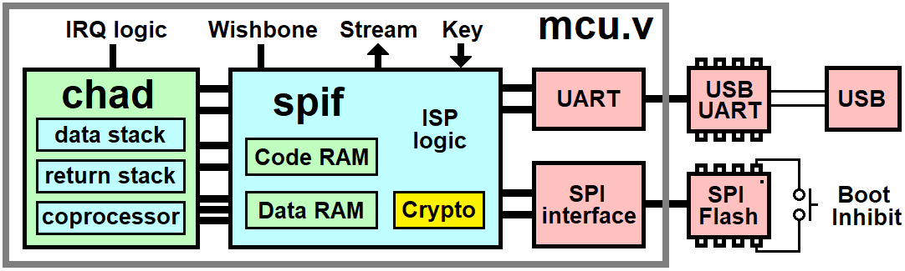

# SPI flash interface

The `spif` SPI flash controller loads code and data memory at boot time.
The controller contains inferred single-port RAM for code and data spaces.
Generics specify the sizes of memory.
It also has an I/O space.
These memory and I/O spaces connect to the ports of a J1 (etc.) CPU.

The design intent here was:

- Ease of inclusion in ASICs
- Flexibility of interfaces
- Hardware support of ISP

Making an ASIC is expensive in terms of time and cost.
To de-risk, code memory should be RAM.
Another reason for RAM-based code space is speed. ROM is slower.
4K bytes of code RAM would be 0.2 mm2 in a 180nm process,
or 0.8mm2 in a 350nm process. Either way the chip is probably pad-limited.

ISP over USB is possible using a cheap ($0.30) USB UART chip, the CH330N.

FPGAs that boot from SPI flash are usually programmed by using another 
controller connected to the SPI flash.
Lattice and Efinix use a FTDI chip on their evaluation boards to program
the flash. A little extra logic (like a 74VHC4051AFT 2:1 mux) could switch
the FT232H between the SPI flash and a 4-wire "FSI UART".
This would supply a nice ISP/debug/streaming port at a cost of maybe $4 above
the super cheap CH330N solution. That might justify using a more expensive
flash-based FPGA such as an Intel MAX10 or a Gowin GW1N.

## Parameters (aka generics)

- CODE_SIZE, log2 of # of 16-bit instruction words in code RAM
- DWIDTH, Word size of data memory
- DATA_SIZE, log2 of # of cells in data RAM
- BASEBLOCK: Which 64KB sector to start user flash at.
Allows room for FPGA bitstream if used.
- PRODUCT_ID0: First product ID byte, user defined.
- PRODUCT_ID1: Second product ID byte, user defined.
- KEY0, KEY1, KEY2, KEY3: SPI flash cypher key

## Ports

Let N be the cell size in bits, 16 to 32.
To keep the J1 naming conventions, the ports on the processor side are:

| Name     | Dir | Bits | Usage                           |
|----------|:---:|-----:|---------------------------------|
| io_rd    | in  | 1    | I/O read strobe: get io_din     |
| io_wr    | in  | 1    | I/O write strobe: register din  |
| mem_addr | in  | 16   | Data memory address             |
| mem_wr   | in  | 1    | Data memory write enable        |
| mem_rd   | in  | 1    | Data memory read enable         |
| din      | in  | N    | Data memory (and I/O) in        |
| mem_dout | out | N    | Data memory out                 |
| io_dout  | out | N    | I/O data out                    |
| code_addr| in  | 16   | Code memory address             |
| insn     | out | 16   | Code memory data                |
| p_hold   | out | 1    | Processor hold                  |
| p_reset  | out | 1    | Processor reset                 |

A streaming byte interface is intended to connect to a host PC. This is usually
a UART. The baud rate is not programmable so that software can't block access.
A simple protocol is used to act as a system master from the PC to:

- Hold the CPU in reset
- Control the SPI flash chip over UART
- Release the CPU's reset

UART ports are:

| Name     | Dir | Bits | Usage                           |
|----------|:---:|-----:|---------------------------------|
| u_ready  | in  | 1    | Ready for next byte to send     |
| u_wr     | out | 1    | UART transmit strobe            |
| u_dout   | out | 8    | UART transmit data              |
| u_full   | in  | 1    | UART has received a byte        |
| u_rd     | out | 1    | UART received strobe            |
| u_din    | in  | 8    | UART received data              |

Other kinds of byte streaming devices can be used with the UART port.
For example, registers in a JTAG chain or a FTDI FT232H in FSI mode.
The latter isn't cheap, but it only takes 4 pins to transfer data at
50 MBPS.

The SPI flash may be shared with a FPGA bitstream.
It may also be virtual, so low-level control is in a separate module.
The handshaking scheme for the flash is similar to that of the UART
except that receive is tied to transmit as is the case with a SPI master.
Flash ports are:

| Name     | Dir | Bits | Usage                           |
|----------|:---:|-----:|---------------------------------|
| f_ready  | in  | 1    | Ready for next byte to send     |
| f_wr     | out | 1    | Flash transmit strobe           |
| f_who    | out | 1    | Who's asking? 0=sys, 1=UART     |
| f_dout   | out | 8    | Flash transmit data             |
| f_format | out | 3    | Flash format                    |
| f_rate   | out | 4    | SPI frequency divider           |
| f_din    | in  | 8    | Flash received data             |

When the `who` signal is `1`, the flash may opt to return blank data.
This would prevent the reading of internal flash via UART ISP.
Although it's not very useful with a board-mounted SPI flash,
a flash subsystem on an ASIC could have lock bits added for security.
A locked flash could return the "Write In Progress" status as data.

f_format is the bus format of the SPI:

- 00x = inactive (CS# = '1')
- 01x = single data rate send and receive
- 100 = dual data rate send
- 101 = dual data rate receive
- 110 = quad data rate send
- 111 = quad data rate receive

## UART ISP protocol

The power-up default is for UART characters to be mapped to I/O space.
An escape sequence activates the ISP protocol, which intercepts UART
data until the ISP exits.

The character 0x12 (^R, DC2) is reserved for the ISP protocol.
The UART presents it to `u_din` and raises `u_full` regardless of whatever
is already buffered. It may discard that. The controller will see `0x12`
and take control of the UART.

Hardware flow control, if it's used, presents a complication here.
Without a RTS to tell the sender it's okay to send the next character,
the `0x12` never shows up. The UART side is responsible for handling
that case by buffering one byte and interpreting it accordingly.

Of the 256 bytes in an 8-bit character, we avoid using XON and XOFF
(0x11 and 0x13) to allow for soft flow control and 0x12 to avoid the
special case.

0x10 fills in the hole left in the character set so that all 256 codes can be
received by `spif`. `0x10 n` is interpreted as:

- 0x10 0x00 = 0x10 
- 0x10 0x01 = 0x11 
- 0x10 0x02 = 0x12 
- 0x10 0x03 = 0x13

ISP command bytes:

- `00nnnnnn` set 12-bit run length N (use two of these)
- `01sfgbpr` s=SPI, f=flashrate, g=gecko, b=boot, p=ping, r=reset
- `10xxxfff` Write N+1 bytes to flash using format fff
- `11xxxfff` Read N+1 bytes from flash using format fff

`01sfgbpr` detail:

- s = SPI cycle: write byte again, reading the result.
- g = Load the cypher with the new key.
- f = set flash bus rate from N.
- b = Reboot from flash.
- p = Trigger a ping. It will send boilerplate out the UART.
- r = Reset the processor.

The ISP commands are enough to erase and program the SPI flash.
When an erase or programming operation is in progress, the chip's WIP
status bit is set. The host PC polls this bit with ISP commands.

Some example ISP sequences are:

- `12 A5 5A` unlocks the ISP, enabling the ISP commands
- `12 00` locks the ISP, disabling the ISP commands
- `41 40` issues a hard reset pulse to the processor
- `42` returns 3 bytes of boilerplate data
- `00 04 81 0B 00 00 00 00 31 C1 80` reads 50 bytes from flash to the UART

### Programming time

Page programming occurs as follows:

- Program a 256-byte page sending 260 chars out the serial port.
- Poll the WIP flag via the UART, falls normally 2.5ms after programming.
- The OS (Windows etc.) inserts another 0 or 1 ms (a USB frame) of delay.
- Read back 256 bytes (260 chars) for verification.

Suppose a 256-byte program-verify sequence has 5.2ms of data transfer time
and 3.0ms of turnaround delay at 1M BPS.
That can be supported by a USB-FS bridge chip like the $0.33 CH330N.
Raising the baud rate wouldn't speed up programming much due to the delays.
Production programming of flash (if you're using much of it) would be
better done by a motherboard flasher like the Dediprog SF100.

Since serial ports are typically USB-UART interface chips, buffer sizes come
into play when the baud rate is somewhat high.
For example, a USB-FS chip like FT2232D (on the Lattice Brevia 2 board) has
a 384-byte output buffer and 256-byte input buffer.
The host PC reads from the input buffer every 1 ms, so continuous input data
is limited to a baud rate of 2.56 MBPS. The Brevia2 demo operates at 1M BPS.

The CH330N has a RTS pin that the UART interface could monitor to hold off
transmission. In the case of ISP, the occasional USB glitch can be tolerated
since pages can be re-programmed in case of bad verification.

### Ping data

A 'ping' command (0x42) sends 5 bytes out the UART:
- BASEBLOCK, first 64KB sector of user flash
- KEYID, identifies the boot code decryption key (0 = plaintext)
- PRODUCT_ID0, product ID\[7:0]
- PRODUCT_ID1, product ID\[15:8]
- 0xAA, sanity check
- RESERVED, ignore this and treat it as a spare slot for future use

The "Product ID" (or `pid`) is used to manage ISP.
If you build products with `chad`, you can pick your own `pid` bytes.
I charge you nothing, unlike rent-seeking bodies like USB-IF and IEEE.
Yup, numbers as free as air.
If you want to reserve your PRODUCT_ID1 to avoid collision with other adopters
of `chad`, add it to this list and do a pull request:

### Reserved PRODUCT_ID values

- 0, Demonstration models for `chad`
- 1 to 99, Reserved for Brad Eckert's commercial projects

## Boot Loader

At power-up, the controller loads code and data memories from flash
before releasing the processor's reset line.

The stream of bytes is interpreted to get start addresses, lengths,
memory types, etc. The stream starts at address 0 (or BASEBLOCK<<16)
using the "fast read" (0Bh) flash command. Boot loader command bytes are:

- `0xxxmmbb` = Load memory from flash, b+1 bytes/word, to code or data space
- `10xxssss` = Set SCLK divisor
- `110xxx00` = Load dest\[7:0] with 8-bit value
- `110xxx01` = Load dest with 16-bit value (big endian)
- `110xxx10` = Load length\[7:0] with 8-bit value
- `110xxx11` = Load length with 16-bit value (big endian)
- `111rxxxx` = End bootup and start processor, r = reset (FF keeps in reset)

The memory type is `0` for code and `1` for data when loading memories from
flash. The protocol has room for a 5-bit memory selection field, so it could
load the memories on 16 different CPU cores or various other devices.
Memory type `2` is for a user output stream.

The SCLK frequency starts out at sysclk / 16 to be conservative.
At some point early on, you should include a command byte to raise the
frequency to more closely match the capability of the flash chip.
For example, `A0` sets the maximum SCLK.

## User output stream

Flash memory can be streamed to a user device without CPU intervention.
Parameter STWIDTH is the number of bits in `st_o`. It may be anything up to
the cell size. 
A `st_stb` strobe is produced when a new word is output.
Writing to register 6 also produces a stream word.

A typical use case for the stream is a TFT LCD module.
A stream of bytes or words in SPI flash can be written to the module without
processor intervention. This could be used to load bitmaps onto the screen.

## I/O space

The 4-bit address: Below 10h = registers, else Wishbone Bus.

Read:

- 0: UART received byte, reading clears the `full` flag.
- 1: UART receive status: 1 = full: there is data
- 2: UART transmit status: 1 = ready: you may write to io\[0]
- 3: SPI flash result byte
- 4: Jam status: 1 = busy
- 5: Boot transfer status: 1 = loading memory from flash
- 6: Raw clock cycle count
- 7: Upper bits of a 32-bit Wishbone Bus read if cells are less than 32-bit 
- 8: Read exception parameter

Write:

- 0: UART transmit
- 1: Set the address for code write
- 2: Write 16-bit instruction to code RAM and bump the address
- 3: Trigger the flash boot interpreter
- 4: Jam an ISP byte (see UART ISP protocol)
- 5: Write key: key = key<<cellbits + n
- 6: Write raw data to user output stream
- 7: Set the upper bits of the next 32-bit Wishbone Bus write
- 8: Save exception parameter

### Jamming ISP bytes

Bytes can be fed into the ISP interpreter by writing them to io\[4].
This way of using the ISP lets software control the SPI flash directly to
execute flash commands. You can set up the DMA registers, start the command,
and trigger a DMA memory load.

Make sure to poll io\[4] to wait until the jammed command has been processed.

### Wishbone Bus Master

The I/O space starting at address 16 (byte address 32 or 64) is mapped to a
Wishbone Bus Master.
To handle 32-bit data when the processor cell size is less than that, a couple of
registers handle the extra bits.

There are no byte lanes in the bus, so `sel_o` is assumed high. 
Since `cyc_o` is always the same as `stb_o`, it is not duplicated.

### Exception parameter

An exception occurs when there is an error.
Exceptions are handled by issuing a hard reset to the CPU and rebooting.
After cold boot, the exception register can be read to determine the reset source.
0 means POR.

## Sample MCU

The MCU in the `verilog` folder connects to SPI flash and a USB UART such as CH330N.
If software somehow manages to disable the ISP, a shorting block or pushbutton can
keep CS# high so the MCU bootloader sees a blank flash so that it doesn't try to
boot up. The UART then has free reign over the SPI flash for programming it.

Any synthesis tool will infer the RAMs, although some will
warn you about possible simulation mismatch. Such problems occur if you try to
read back a word that was written to the same address in the previous cycle.
That won't happen in this architecture, the way `chad` is set up.

## Why spif?

Should I have stuck with a boot ROM for this? The advantages of `spif` are:

- No ROM required: RAMs are loaded from SPI flash by hardware at bootup.
- No extra mux in the `inst` datapath, which would slow instruction decoding.
- The UART can be used for programming flash memory without a ROM.
- Decryption hardware protects code stored in easily accessed flash.
- Code may stream in flash data using DMA instead of code.

Thanks to the DMA, the processor can work on data streamed in from flash while
loading the next data it's going to use.
So, spending 10% to 20% more on logic frees up processing power that would otherwise
be spent spinning in a loop waiting for bytes to move through the SPI.

### Encryption

The easiest method of encryption is to use a stream cypher to
decrypt the boot stream inside of `spif` as SPI flash data is loaded.
I went ahead and put this in, adding 200 LEs to the size. Not bad.
There are some very compact stream ciphers. LIZARD is one of the smallest.
This use case didn't need the sophisticated key initialization sequence of
LIZARD, so I simplified it and named the module "gecko".

Along with the fact that random read of code space isn't supported by hardware,
making the plaintext unavailable, attacks will likely have to be brute-force.
A 56-bit key is used so that publication of source code isn't an export problem.
A large network of FPGAs could crack it if it's used as-is.

A fixed key has its downsides, which
should be addressed if the design moves to ASIC.
The key could be fuse-programmable, for example.
Then the security burden moves to programming hardware, which you control.
The typical strategy for key generation is to tie the key to the product serial
number, also programmed, through a KDF (key derivation function) based on an
irreversible and compute-intensive hash.

You have the option of not using a key (setting it to 0), which makes the 
keystream also 0 so that it doesn't decrypt anything.
Just keep the SPI flash contents in plaintext.

### Synthesis results

A demo MCU with UART, SPI flash interface, 16-deep stacks, and the
`chad` processor produced these synthesis results for small FPGAs.
Note that Fmax varies with synthesis tool settings.
These were with out-of-the-box defaults. Consider them approximations.
Also, the numbers don't keep up with feature creep.

| FPGA part#      | Vendor  | 16-bit | 18-bit | 24-bit | 32-bit | Fmax|
|-----------------|:-------:|-------:|-------:|-------:|-------:|----:|
| 10M04SCE144C8G  | Intel   | 1731   | 1842   | 2169   | 3544   | 105 |
| LFXP2-5E-TN144C | Lattice | 1503   | 1614   | 1876   | 2254   |  90 |
